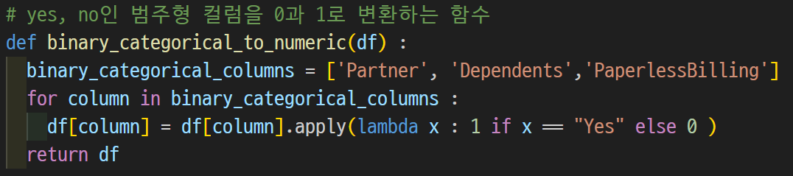
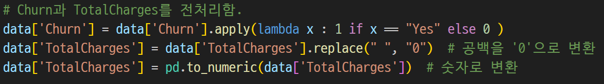
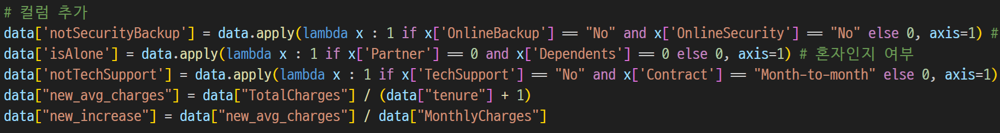
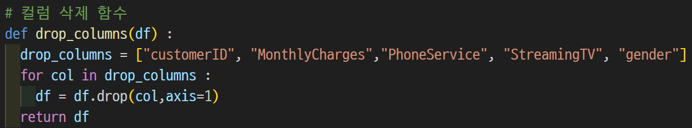
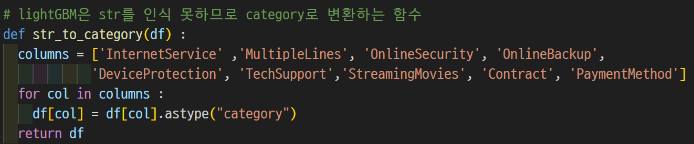

# SKN10-2nd-5Team
# [가입 고객 이탈 예측](https://www.kaggle.com/code/bbksjdd/telco-customer-churn)
## EDA 분석

- **히트맵**을 출력하여 각 특성들의 연관도를 표시한다.
표현해보니 **StreamingTV와 StreamMovies의 연관도가 0.8이상으로 매우 높다.**

- **카이제곱 검정**을 이용해 Churn(이탈 여부)와 특성간의 관련도를 표시하여
gender와 PhoneService가 Churn(이탈 여부)와 관련이 적다는 것을 알 수 있다. 

- 각 특성과 Churn(이탈 여부)를 **막대 그래프로 시각화했다.**

- 노인(1142명)중 이탈한 노인이 476명으로, 41%이다.

- 이탈한 고객중 OnlineSecurity와 OnlineBackup를 쓰지않은 고객이 48%이다.

- 인터넷 서비스를 **Fiber optic**로 쓰는 사람이 제일 돈을 많이 낸다. 

**이탈한 고객(1869명)의 대부분이 Month-to-Month 계약**을 했고, 그 중에서 TechSupport를 안쓰는 고객이 1350명이다.

## Data Cleaning

- 컬럼값이 Yes, No인 컬럼들을 1과 0으로 변환

- Churn의 컬럼값을 0 또는 1로 변환
- TotalCharges가 type이 문자형이라 숫자로 변환

- notSecurityBackup, isAlone, notTechSupport, new_avg_charges, new_increase 컬럼을 추가

- 관련도가 적거나 특성 중요도가 낮은 컬럼들 삭제

- lightGBM모델은 str을 모두 Categorical 자료형으로 변환해야됨.

