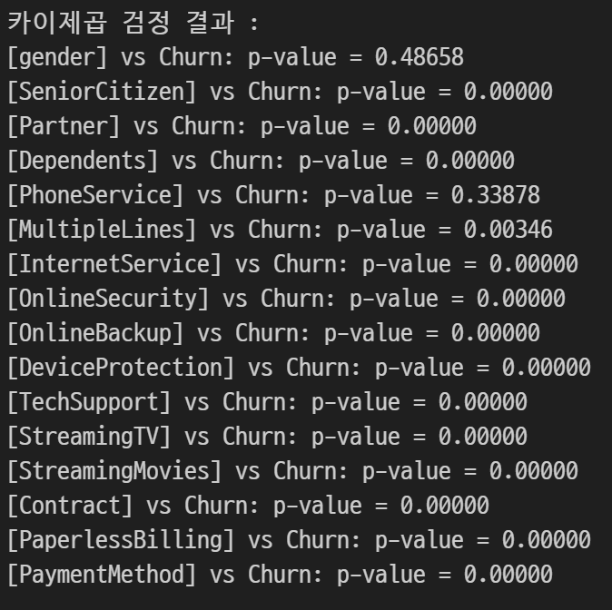
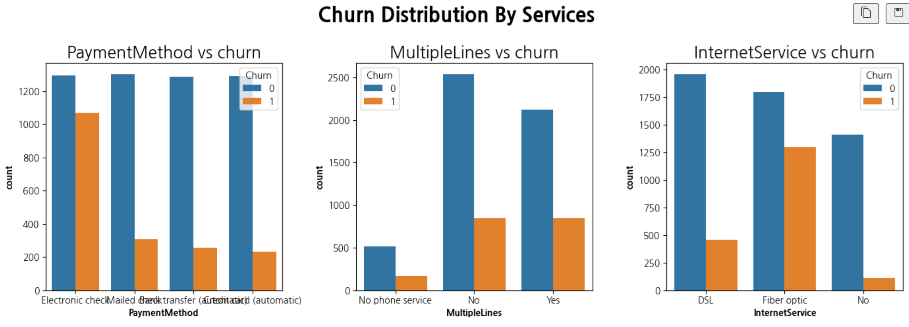
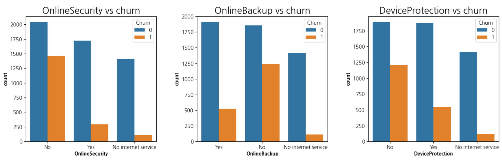
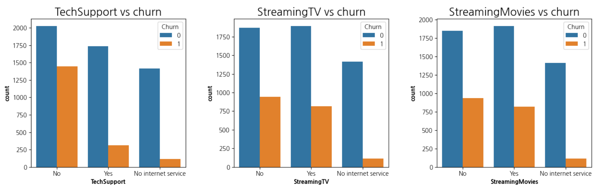
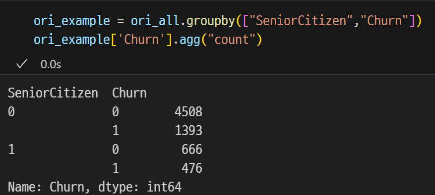
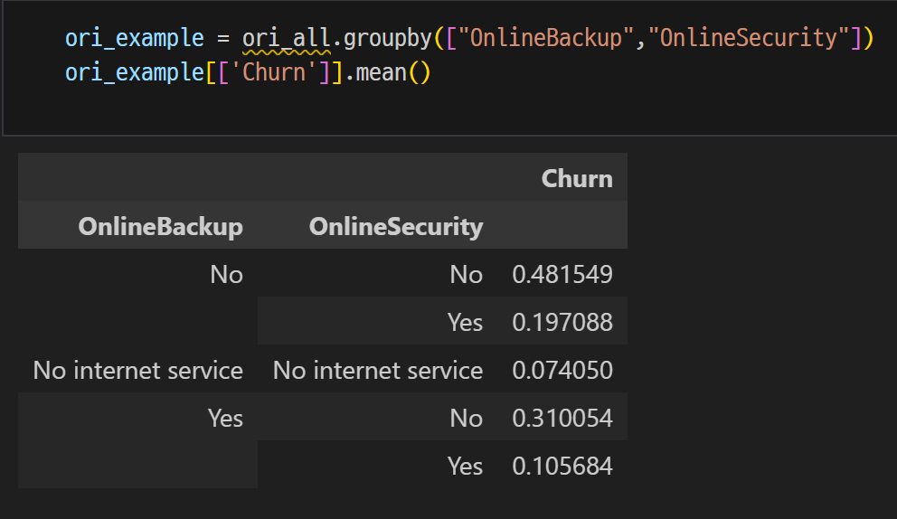
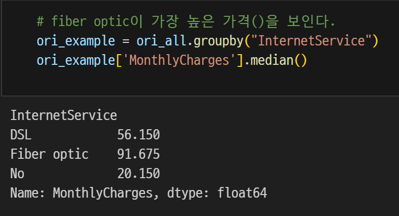
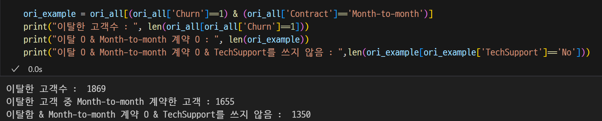

# SKN10-2nd-5Team
# [가입 고객 이탈 예측](https://www.kaggle.com/code/bbksjdd/telco-customer-churn)
## EDA 분석

히트맵을 출력하여 각 특성들의 연관도를 표시한다.
표현해보니 StreamingTV와 StreamMovies의 연관도가 0.8이상으로 매우 높다.

카이제곱 검정을 이용해 Churn(이탈 여부)와 특성간의 관련도를 표시하여
gender와 PhoneService가 Churn(이탈 여부)와 관련이 적다는 것을 알 수 있다. 

각 특성과 Churn(이탈 여부)를 막대 그래프로 시각화했다.

노인(1142명)중 이탈한 노인이 476명으로, 41%이다.

이탈한 고객중 OnlineSecurity와 OnlineBackup를 쓰지않은 고객이 48%이다.

인터넷 서비스를 Fiber optic로 쓰는 사람이 제일 돈을 많이 낸다. 

이탈한 고객(1869명)의 대부분이 Month-to-Month 계약을 했고, 그 중에서 TechSupport를 안쓰는 고객이 1350명이다.

## Data Cleaning
