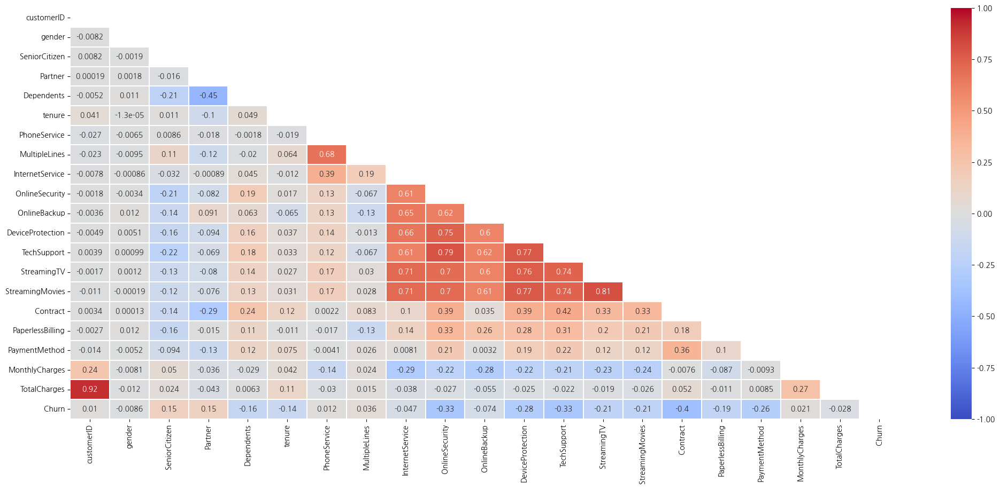
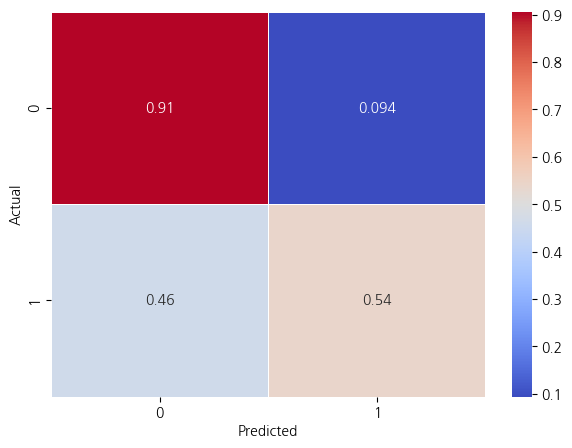

# SKN10-2nd-5Team
<br/>


<br/>
<br/>

## ⭐ 프로젝트 팀
<br/>

<table style="width: 100%; table-layout: fixed;">
  <tr>
    <td style="text-align: center; width: 20%;">&nbsp;&nbsp;&nbsp;&nbsp;이서영&nbsp;&nbsp;&nbsp;&nbsp;</td>
    <td style="text-align: center; width: 20%;">&nbsp;&nbsp;&nbsp;&nbsp;경규휘&nbsp;&nbsp;&nbsp;&nbsp;</td>
    <td style="text-align: center; width: 20%;">&nbsp;&nbsp;&nbsp;&nbsp;권석현&nbsp;&nbsp;&nbsp;&nbsp;</td>
    <td style="text-align: center; width: 20%;">&nbsp;&nbsp;&nbsp;&nbsp;원유형&nbsp;&nbsp;&nbsp;&nbsp;</td>
    <td style="text-align: center; width: 20%;">&nbsp;&nbsp;&nbsp;&nbsp;좌민서&nbsp;&nbsp;&nbsp;&nbsp;</td>
  </tr>
  <tr>
    <td style="text-align: center; width: 20%;">모델 설계<br/>화면 구현</td>
    <td style="text-align: center; width: 20%;">모델 설계<br/>화면 구현</td>
    <td style="text-align: center; width: 20%;">모델 설계<br/>화면 구현</td>
    <td style="text-align: center; width: 20%;">모델 설계<br/>화면 구현</td>
    <td style="text-align: center; width: 20%;">모델 설계<br/>화면 구현</td>
  </tr>
  <tr>
    <td style="text-align: center; width: 20%;"><a href="https://github.com/Eseo0">@Lee Seoyoung</a></td>
    <td style="text-align: center; width: 20%;"><a href="https://github.com/kqe123">@kqe0012</a></td>
    <td style="text-align: center; width: 20%;"><a href="https://github.com/seo-droid">@seo-droid</a></td>
    <td style="text-align: center; width: 20%;"><a href="https://github.com/uhyeong">uhyeong</a></td>
    <td style="text-align: center; width: 20%;"><a href="https://github.com/INe904">@INe</a></td>
  </tr>
</table>
<br/>

## 📌 프로젝트 개요
<br/>

### 프로젝트 주제
<br/>

**통신사 고객 이탈 예측**
<br/>
<br/>

### 프로젝트 목적
<br/>

본 서비스는 통신사의 고객 이탈을 예측하고, 이탈 가능성이 높은 고객을 사전에 식별하여 이탈을 방지하는 전략을 수립하는 데 도움을 주는 것을 목표로 한다.<br/>이를 통해 통신사는 고객의 만족도를 향상시키고, 이탈률을 감소시킬 수 있다.
<br/>
<br/>

### 프로젝트 필요성
<br/>

**1. 고객 이탈 문제 해결**
- 통신사에서는 고객의 이탈이 발생할 경우, 새로운 고객 유치에 드는 비용이 더 크기 때문에, 기존 고객의 유지를 강화하는 것이 중요하다.
<br/>

**2. 경쟁이 치열한 시장 환경**
- 통신사 간의 경쟁이 치열해지면서, 고객의 이탈을 방지하는 것이 기업의 생존과 직결되는 문제로 대두되고 있다.
<br/>

**3. 데이터 기반 의사결정**
- 고객 데이터를 분석하여 이탈 가능성을 예측함으로써, 전략적인 마케팅 및 고객 관리가 가능하다.
<br/>
<br/>

### 프로젝트 내용
<br/>

**1. 고객 데이터 분석**
- [**통신사의 고객 데이터**](https://www.kaggle.com/datasets/blastchar/telco-customer-churn)를 기반으로 이탈 가능성에 영향을 미치는 주요 요인들을 식별한다.
<br/>

**2. 예측 모델 개발**
- 머신러닝 및 통계적 기법을 활용하여 고객의 이탈 가능성을 예측하는 모델을 구축한다. 이를 통해 고객의 행동을 분석하고, 이탈을 사전에 감지할 수 있다.
<br/>
<br/>

### 프로젝트 기대 효과
<br/>

**1. 고객 이탈률 감소**
- 이탈 가능성이 높은 고객을 미리 예측하고, 예방 조치를 취함으로써 이탈률을 효과적으로 줄일 수 있다.
<br/>

**2. 고객 만족도 향상**
- 고객의 불만이나 요구를 사전에 파악하고, 적절한 조치를 취함으로써 고객 만족도를 높일 수 있다.
<br/>

**3. 통신사의 경쟁력 강화**
- 경쟁사 대비 고객 유지를 강화하고, 안정적인 수익 기반을 확보함으로써 기업의 경쟁력을 높일 수 있다.
<br/>
<br/>

## 📌 기술 스택
<br/>

### 화면 설계
<br/>


<br/>

### 모델 설계
<br/>

 &nbsp;  &nbsp;  &nbsp; 
<br/>

### 화면 구현
<br/>


<br/>

### 버전 관리 및 협업
<br/>

 &nbsp; 
<br/>
<br/>

## 📌 설치/사용 방법
<br/>

### 1. GitHub에서 Repository Clone
<br/>

```python
    git clone https://github.com/SKNETWORKS-FAMILY-AICAMP/SKN10-2nd-5Team.git
```
<br/>

### 2. 가상환경 구축
<br/>

```python
    py -3.13 -m venv .venv
    .\.venv\Scripts\activate
    python -m pip install --upgrade pip
```
<br/>

### 3. 라이브러리 설치
<br/>

```python
    pip install -r requirements.txt
```
<br/>

### 4. 서비스 실행
<br/>

**모델 생성 및 정확도 계산**
```python
    python service/run.py
```

#### 고객 예측 서비스
```python
    streamlit run mainpage.py
```
<br/>
<br/>

## 데이터
<br/>

<table style="width: 100%; table-layout: fixed;">
  <tr>
    <th style="text-align: center; width: 20%;">column</td>
    <th style="text-align: center; width: 60%;">description</td>
    <th style="text-align: center; width: 20%;">data type</td>
  </tr>
  <tr>
    <td style="text-align: center; width: 20%;">customerID</td>
    <td style="text-align: center; width: 60%;">고객 ID</td>
    <td style="text-align: center; width: 20%;">object</td>
  </tr>
  <tr>
    <td style="text-align: center; width: 20%;">gender</td>
    <td style="text-align: center; width: 60%;">성별</td>
    <td style="text-align: center; width: 20%;">object<br/>Male / Female</td>
  </tr>
  <tr>
    <td style="text-align: center; width: 20%;">SeniorCitizen</td>
    <td style="text-align: center; width: 60%;">고객의 노인 여부</td>
    <td style="text-align: center; width: 20%;">int64<br/>1 / 0</td>
  </tr>
  <tr>
    <td style="text-align: center; width: 20%;">Partner</td>
    <td style="text-align: center; width: 60%;">고객의 파트너 여부</td>
    <td style="text-align: center; width: 20%;">object<br/>Yes / No</td>
  </tr>
  <tr>
    <td style="text-align: center; width: 20%;">Dependents</td>
    <td style="text-align: center; width: 60%;">고객의 부양가족 여부</td>
    <td style="text-align: center; width: 20%;">object<br/>Yes / No</td>
  </tr>
  <tr>
    <td style="text-align: center; width: 20%;">tenure</td>
    <td style="text-align: center; width: 60%;">고객의 가입 개월 수</td>
    <td style="text-align: center; width: 20%;">int64</td>
  </tr>
  <tr>
    <td style="text-align: center; width: 20%;">PhoneService</td>
    <td style="text-align: center; width: 60%;">전화 서비스 이용 여부</td>
    <td style="text-align: center; width: 20%;">object<br/>Yes / No</td>
  </tr>
  <tr>
    <td style="text-align: center; width: 20%;">MultipleLines</td>
    <td style="text-align: center; width: 60%;">다중 회선 유무</td>
    <td style="text-align: center; width: 20%;">object<br/>Yes / No / No phone service</td>
  </tr>
  <tr>
    <td style="text-align: center; width: 20%;">InternetService</td>
    <td style="text-align: center; width: 60%;">인터넷 서비스 종류</td>
    <td style="text-align: center; width: 20%;">object<br/>DSL / Fiber optic / No</td>
  </tr>
  <tr>
    <td style="text-align: center; width: 20%;">OnlineSecurity</td>
    <td style="text-align: center; width: 60%;">온라인 보안 서비스 이용 여부</td>
    <td style="text-align: center; width: 20%;">object<br/>Yes / No / No internet service</td>
  </tr>
  <tr>
    <td style="text-align: center; width: 20%;">OnlineBackup</td>
    <td style="text-align: center; width: 60%;">온라인 백업 서비스 이용 여부</td>
    <td style="text-align: center; width: 20%;">object<br/>Yes / No / No internet service</td>
  </tr>
  <tr>
    <td style="text-align: center; width: 20%;">DeviceProtection</td>
    <td style="text-align: center; width: 60%;">기기 보호 서비스 이용 여부</td>
    <td style="text-align: center; width: 20%;">object<br/>Yes / No / No internet service</td>
  </tr>
  <tr>
    <td style="text-align: center; width: 20%;">TechSupport</td>
    <td style="text-align: center; width: 60%;">기술 지원 서비스 이용 여부</td>
    <td style="text-align: center; width: 20%;">object<br/>Yes / No / No internet service</td>
  </tr>
  <tr>
    <td style="text-align: center; width: 20%;">StreamingTV</td>
    <td style="text-align: center; width: 60%;">스트리밍 TV 서비스 이용 여부</td>
    <td style="text-align: center; width: 20%;">object<br/>Yes / No / No internet service</td>
  </tr>
  <tr>
    <td style="text-align: center; width: 20%;">StreamingMovies</td>
    <td style="text-align: center; width: 60%;">스트리밍 영화 서비스 이용 여부</td>
    <td style="text-align: center; width: 20%;">object<br/>Yes / No / No internet service</td>
  </tr>
  <tr>
    <td style="text-align: center; width: 20%;">Contract</td>
    <td style="text-align: center; width: 60%;">고객의 계약 기간</td>
    <td style="text-align: center; width: 20%;">object<br/>Month-to-month / One year / Two year</td>
  </tr>
  <tr>
    <td style="text-align: center; width: 20%;">PaperlessBiling</td>
    <td style="text-align: center; width: 60%;">무서류 청구서 사용 여부</td>
    <td style="text-align: center; width: 20%;">object<br/>Yes / No</td>
  </tr>
  <tr>
    <td style="text-align: center; width: 20%;">PaymentMethod</td>
    <td style="text-align: center; width: 60%;">고객의 결제 수단</td>
    <td style="text-align: center; width: 20%;">object<br/>Electronic check / Mailed check / Bank transfer(automatic) / Credit card (automatic)</td>
  </tr>
  <tr>
    <td style="text-align: center; width: 20%;">MonthlyCharges</td>
    <td style="text-align: center; width: 60%;">월 청구 금액</td>
    <td style="text-align: center; width: 20%;">float64</td>
  </tr>
  <tr>
    <td style="text-align: center; width: 20%;">TotalCharges</td>
    <td style="text-align: center; width: 60%;">총 청구 금액</td>
    <td style="text-align: center; width: 20%;">object</td>
  </tr>
  <tr>
    <td style="text-align: center; width: 20%;">Churn</td>
    <td style="text-align: center; width: 60%;">고객의 이탈 여부</td>
    <td style="text-align: center; width: 20%;">object<br/>Yes / No</td>
  </tr>
</table>
<br/>
<br/>

## 💻 화면 설계
<br/>

### 메인 페이지
<br/>


<br/>

### EDA
<br/>


<br/>
<br/>

## 📊 Machine Learning - EDA
<br/>

### Data Analyze
<br/>

**1. 히트맵**
- 각 특성들의 연관도 확인
<br/>


<br/>

**2. 카이제곱 검정**
- Churn(이탈 여부)과 특성 간의 관련도
  - gender와 PhoneService가 Churn과 관련이 적음
<br/>


<br/>

**3. 막대 그래프**
- 특성에 따른 Churn의 분포
<br/>


<br/>

**4. 데이터 분석**
- **Senior** 고객(1142명) 중 이탈한 노인 고객(276명)이 41%를 차지한다.
<br/>


<br/>

- 이탈한 고객 중 **OnlineSecurity**와 **OnlineBackup** 서비스를 사용하지 않는 고객이 48%를 차지한다.
<br/>


<br/>

- **InternetService**를 **Fiber optic**으로 사용하는 사람이 제일 돈을 많이 지불한다.
<br/>


<br/>

- 이탈한 고객(1869명)의 대부분이 **Month-to-Month** 계약을 했고, 그 중에서 **TechSupport** 서비스를 사용하지 않는 고객이 1350명이다.
<br/>


<br/>
<br/>

## ⚙️ Machine Learning - 모델 설계
<br/>

### Data Cleaning
<br/>

**1. Data Encoding**
- **Yes / No**의 컬럼 값을 **1 / 0**으로 변환한다.
<br/>


<br/>

- **Churn**의 컬럼 값을 **1 / 0**으로 변환한다.

- **TotalCharges**의 타입을 숫자형으로 변환한다.
<br/>


<br/>

- **LightGBM** 모델은 str 자료형을 categorical 자료형으로 변환해야 한다.
<br/>


**2. Feature Extraction**
- **notSecurityBackup**, **isAlone**, **notTechSupport**, **new_avg_charges**, **new_increase** 특성을 추가한다.
<br/>


<br/>

- 관련도가 적거나 특성 중요도가 낮은 특성들을 제거한다.
<br/>


<br/>
<br/>

### Data Scaling & Encoding
- LightGBM 모델은 별도의 스케일링이나 인코딩 과정이 필요하지 않으므로 생략한다.
<br/>
<br/>

### Model Training & Testing
<br/>

**1. Train / Test 데이터 분리**
<br/>


<br/>

**2. 교차검증(10번) 및 Train / Test 점수 확인**
<br/>


<br/>

**3. 평가 지표**
<br/>


<br/>

**4. 함수 실행 및 모델 저장**
<br/>


<br/>

**5. 교차검증 시행 시 정확도 평균: 80%**
<br/>


<br/>

**6. 테스트 점수: 81%**
<br/>


<br/>

**7. 혼동 행렬**
<br/>


<br/>
<br/>

## 📌 프로젝트 최종 결과
<br/>

### Mainpage
<br/>


<br/>

### EDA
<br/>


<br/>


<br/>
<br/>


## 💻 이슈 및 해결방법
<br/>


## ✍️ 팀원별 느낀점
<br/>

### 이서영
<br/>

<br/>

### 경규휘
<br/>

<br/>

### 권석현
<br/>

<br/>

### 원유형
<br/>

<br/>

### 좌민서
<br/>

<br/>