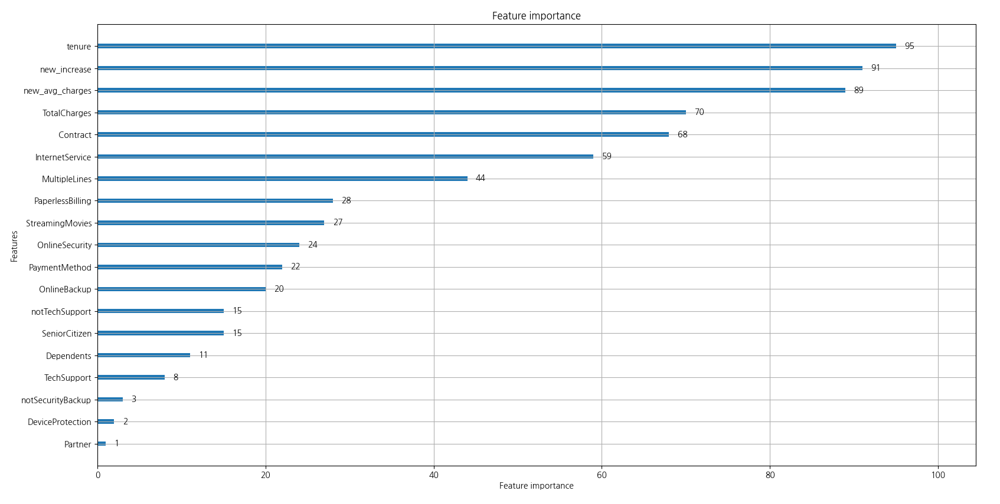
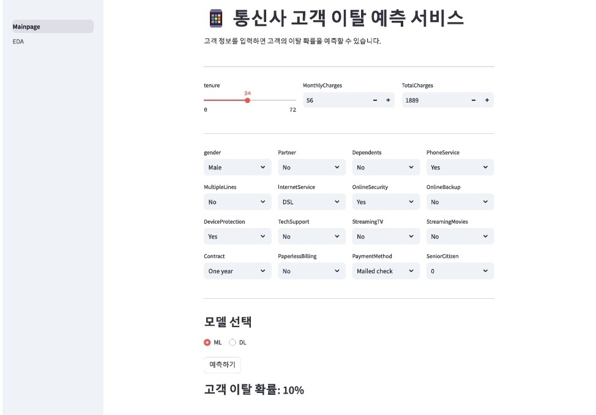
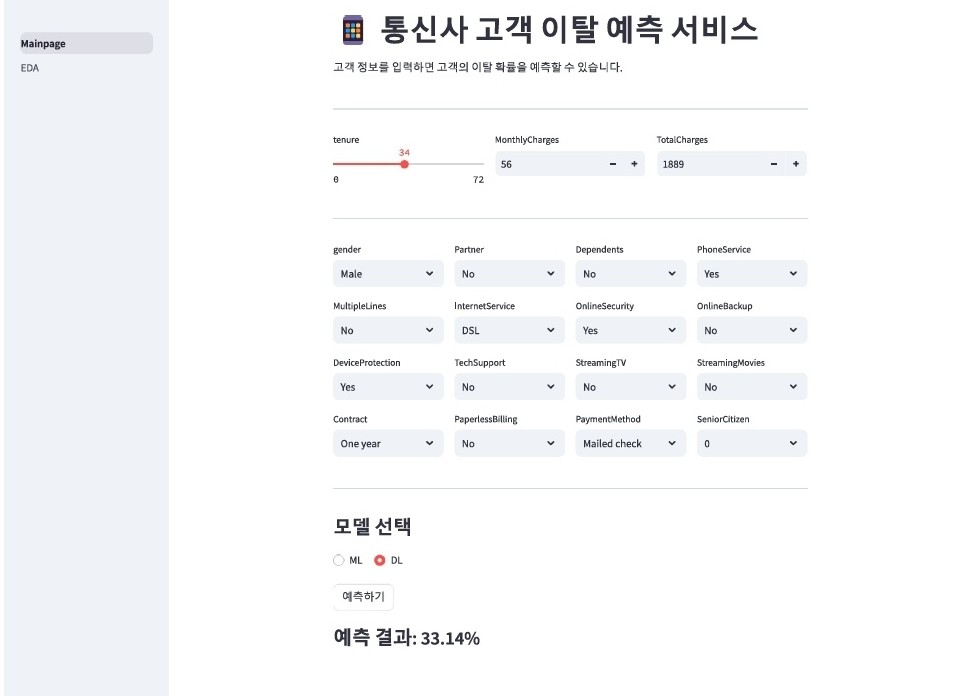
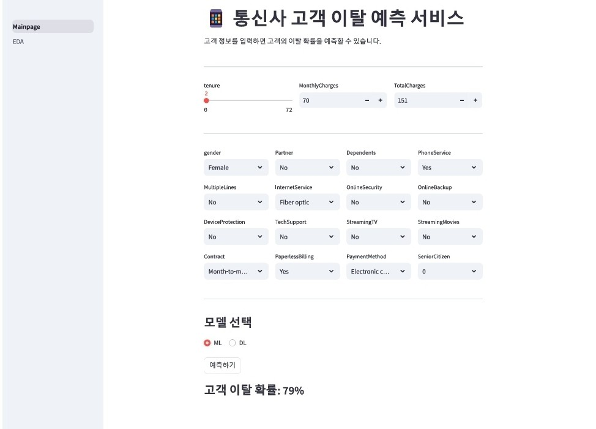
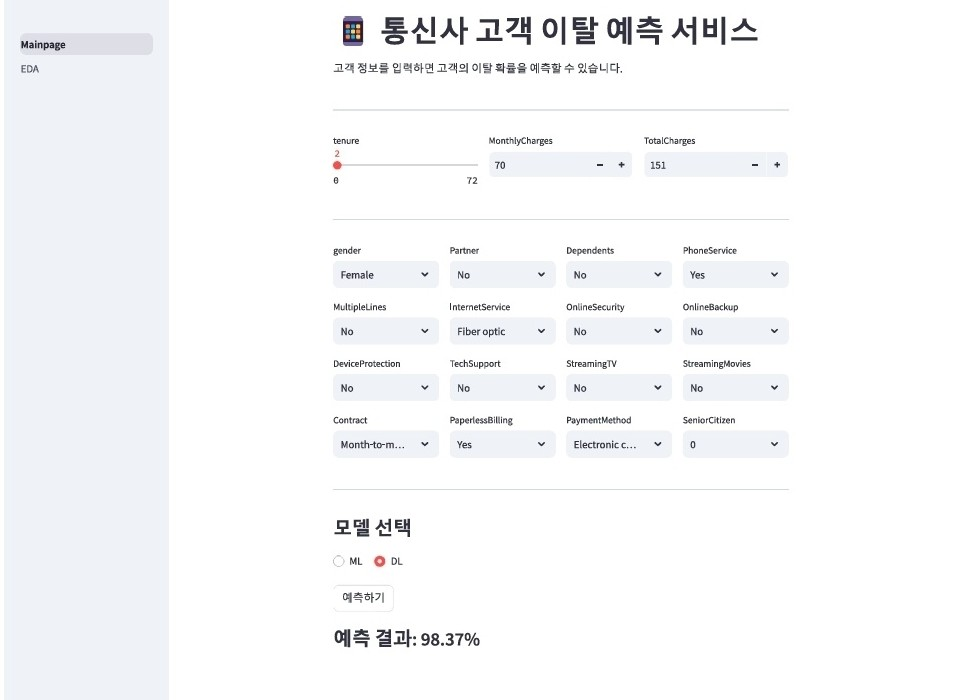

# SKN10-2nd-5Team
<br/>

## ⭐ 프로젝트 팀
<br/>

### 이탈자 추격조
<br/>


<table align=center>
    <tbody>
        <tr>
            <td align=center><b>이서영</b></td>
            <td align=center><b>경규휘</b></td>
            <td align=center><b>권석현</b></td>
            <td align=center><b>원유형</b></td>
            <td align=center><b>좌민서</b></td>
        </tr>
        <br>
        <tr>
            <td align=center>팀장</div></a></td>
            <td align=center>팀원</div></a></td>
            <td align=center>팀원</div></a></td>
            <td align=center>팀원</div></a></td>
            <td align=center>팀원</div></a></td>
        </tr>
        <br>
        <tr>
            <td align=center>모델 설계 - ML<br/>(GradientBoost)<br/>화면 구현</div></a></td>
            <td align=center>모델 설계 - ML<br/>(LightGBM)<br/> EDA</div></a></td>
            <td align=center>모델 설계 - DL<br/> (MLP)</div></a></td>
            <td align=center>모델 설계 - ML<br/>(Voting)<br/>화면 설계</div></a></td>
            <td align=center>모델 설계 - ML<br/>(XGBoost)<br/>화면 구현</div></a></td>
        </tr>
        <br>
        <tr>
            <td><a href="https://github.com/Eseo0"><div align=center>@Lee Seoyoung</div></a></td>
            <td><a href="https://github.com/kqe123"><div align=center>@kqe0012</div></a></td>
            <td><a href="https://github.com/seo-droid"><div align=center>@seo-droid</div></a></td>
            <td><a href="https://github.com/uhyeong"><div align=center>@uhyeong</div></a></td>
            <td><a href="https://github.com/INe904"><div align=center>@INe</div></a></td>
        </tr>
    </tbody>
</table>
<br/>
<br/>

## 📌 프로젝트 개요
<br/>

### 프로젝트 주제
<br/>

**통신사 고객 이탈 예측**
<br/>
<br/>

### 프로젝트 목적
<br/>

본 서비스는 통신사의 고객 이탈을 예측하고, 이탈 가능성이 높은 고객을 사전에 식별하여 이탈을 방지하는 전략을 수립하는 데 도움을 주는 것을 목표로 한다.<br/>이를 통해 통신사는 고객의 만족도를 향상시키고, 이탈률을 감소시킬 수 있다.
<br/>
<br/>

### 프로젝트 필요성
<br/>

**1. 고객 이탈 문제 해결**
- 통신사에서는 고객의 이탈이 발생할 경우, 새로운 고객 유치에 드는 비용이 더 크기 때문에, 기존 고객을 유지하는 것이 중요하다.
<br/>

**2. 경쟁이 치열한 시장 환경**
- 통신사 간의 경쟁이 치열해지면서, 고객의 이탈을 방지하는 것이 기업의 생존과 직결되는 문제로 대두되고 있다.
<br/>

**3. 데이터 기반 의사결정**
- 고객 데이터를 분석하여 이탈 가능성을 예측함으로써, 전략적인 마케팅 및 고객 관리가 가능하다.
<br/>
<br/>

### 프로젝트 내용
<br/>

**1. 고객 데이터 분석**
- [**통신사의 고객 데이터**](https://www.kaggle.com/datasets/blastchar/telco-customer-churn)를 기반으로 이탈 가능성에 영향을 미치는 주요 요인들을 식별한다.
<br/>

**2. 예측 모델 개발**
- 머신러닝 및 딥러닝, 통계적 기법을 활용하여 고객의 이탈 가능성을 예측하는 모델을 구축한다. 이를 통해 고객의 행동을 분석하고, 이탈을 사전에 감지할 수 있다.
<br/>
<br/>

### 프로젝트 기대 효과
<br/>

**1. 고객 이탈률 감소**
- 이탈 가능성이 높은 고객을 미리 예측하고, 예방 조치를 취함으로써 이탈률을 효과적으로 줄일 수 있다.
<br/>

**2. 고객 만족도 향상**
- 고객의 불만이나 요구를 사전에 파악하고, 적절한 조치를 취함으로써 고객의 만족도를 높일 수 있다.
<br/>

**3. 통신사의 경쟁력 강화**
- 경쟁사 대비 고객 유지를 강화하고, 안정적인 수익 기반을 확보함으로써 기업의 경쟁력을 높일 수 있다.
<br/>
<br/>

## 📌 기술 스택
<br/>

### 화면 설계
<br/>


<br/>

### 모델 설계
<br/>

 &nbsp;  &nbsp;  &nbsp; 
<br/>

### 화면 구현
<br/>


<br/>

### 버전 관리 및 협업
<br/>

 &nbsp;  &nbsp; 
<br/>
<br/>

## 📌 설치/사용 방법
<br/>

### 1. GitHub에서 Repository Clone
<br/>

```python
    git clone https://github.com/SKNETWORKS-FAMILY-AICAMP/SKN10-2nd-5Team.git
```
<br/>

### 2. 가상환경 구축
<br/>

```python
    py -3.13 -m venv .venv
    .\.venv\Scripts\activate
    python -m pip install --upgrade pip
```
<br/>

### 3. 라이브러리 설치
<br/>

```python
    pip install -r requirements.txt
```
<br/>

### 4. 서비스 실행
<br/>

**모델 생성 및 정확도 계산**

- 실행되지 않을 경우, service/preprocess.py의 `from service.utils import reset_seeds`을 주석처리 하고, `from utils import reset_seeds`의 주석을 해제하여 실행한다.

```python
    # Machine Learning Model - LightGBM
    python service/run.py

    # Deep Learning Model - MLP
    python service/run_dl.py
```

<br/>

#### 고객 예측 서비스

- 실행되지 않을 경우, service/preprocess.py의 `from utils import reset_seeds`을 주석처리 하고, `from service.utils import reset_seeds`의 주석을 해제하여 실행한다다.

```python
    streamlit run Mainpage.py
```

<br/>
<br/>

## 📄 초기 데이터 정보
<br/>

### 통신사 고객 데이터
<br/>

| **Column** | **Description** | **Data Type** |
| ---: | :--- | :--- |
| **customerID** | 고객 ID | object |
| **gender** | 성별 | object<br/>- Male / Female |
| **SeniorCitizen** | 고객의 노인 여부 | int64<br/>- 1 / 0 |
| **Partner** | 고객의 파트너 여부 | object<br/>- Yes / No |
| **Dependents** | 고객의 부양가족 여부 | object<br/>- Yes / No |
| **tenure** | 고객의 통신사 가입 기간(개월) | int64 |
| **PhoneService** | 전화 서비스 이용 여부 | object<br/>- Yes / No |
| **MultipleLines** | 다중 회선 유무 | object<br/>- Yes / No / No phone service |
| **InternetService** | 인터넷 서비스 종류 | object<br/>- DSL / Fiber optic / No |
| **OnlineSecurity** | 온라인 보안 서비스 이용 여부 | object<br/>- Yes / No / No internet service |
| **OnlineBackup** | 온라인 백업 서비스 이용 여부 | object<br/>- Yes / No / No internet service |
| **DeviceProtection** | 기기 보호 서비스 이용 여부 | object<br/>- Yes / No / No internet service |
| **TechSupport** | 기술 지원 서비스 이용 여부 | object<br/>- Yes / No / No internet service |
| **StreamingTV** | 스트리밍 TV 서비스 이용 여부 | object<br/>- Yes / No / No internet service |
| **StreamingMovies** | 스트리밍 영화 서비스 이용 여부 | object<br/>- Yes / No / No internet service |
| **Contract** |고객의 계약 기간  | object<br/>- Month-to-month / One year / Two year |
| **PaperlessBiling** | 무서류 청구서 사용 여부 | object<br/>- Yes / No |
| **PaymentMethod** | 고객의 결제 수단 | object<br/>- Electronic check / Mailed check<br/>/ Bank transfer(automatic) / Credit card (automatic) |
| **MonthlyCharges** | 월 청구 금액 | float64 |
| **TotalCharges** | 총 청구 금액 | object |
| **Churn** | 고객의 이탈 여부 | object<br/>- Yes / No |
<br/>
<br/>

## 📊 EDA
<br/>

### Data Analyze
<br/>

**1. 히트맵**
- 각 특성들의 **연관도** 확인
    - **StreamingTV**와 **StreamingMovies**의 연관도가 0.8 이상으로 매우 높음
<br/>


<br/>

**2. 카이제곱 검정**
- Churn(이탈 여부)과 특성 간의 **관련도**
    - gender와 PhoneService가 Churn과 관련이 적음
<br/>


<br/>

**3. 막대 그래프**
- 특성에 따른 Churn의 **분포**
<br/>


<br/>

**4. 데이터 분석**
- **Senior** 고객(1142명) 중 이탈한 노인 고객(276명)이 41%를 차지한다.
<br/>


<br/>

- 이탈한 고객 중 **OnlineSecurity**와 **OnlineBackup** 서비스를 사용하지 않는 고객이 48%를 차지한다.
<br/>


<br/>

- **InternetService**를 **Fiber optic**으로 사용하는 사람이 제일 돈을 많이 지불한다.
<br/>


<br/>

- 이탈한 고객(1869명)의 대부분이 **Month-to-Month** 계약을 했고, 그 중에서 **TechSupport** 서비스를 사용하지 않는 고객이 1350명이다.
<br/>


<br/>
<br/>

## ⚙️ Machine Learning - 모델 설계
<br/>

### Data Cleaning
<br/>

**1. Data Encoding**
- **Yes / No**의 컬럼 값을 **1 / 0**으로 변환한다.
<br/>


<br/>

- **Churn**의 컬럼 값을 **1 / 0**으로 변환한다.

- **TotalCharges**의 타입을 숫자형으로 변환한다.
<br/>


<br/>

- **LightGBM** 모델은 str 자료형을 categorical 자료형으로 변환해야 한다.
<br/>


**2. Feature Extraction**
- **notSecurityBackup**, **isAlone**, **notTechSupport**, **new_avg_charges**, **new_increase** 특성을 추가한다.
<br/>


<br/>

- 관련도가 적거나 특성 중요도가 낮은 특성들을 제거한다.
<br/>


<br/>

<br/>

### Data Scaling & Encoding
<br/>

- **LightGBM 모델**은 별도의 스케일링이나 인코딩 과정이 필요하지 않으므로 생략한다.
<br/>

- 데이터가 불균형적이기 때문에 샘플링 수행
    - 테스트 점수가 떨어져 샘플링 제거
<br/>
<br/>

### Model Training & Testing
<br/>

**1. Train / Test 데이터 분리**
<br/>


<br/>

**2. 교차검증(10번) 및 Train / Test 점수 확인**
<br/>


<br/>

**3. 평가 지표**
<br/>


<br/>

**4. 함수 실행 및 모델 저장**
<br/>


<br/>

**5. 교차검증 시행 시 정확도 평균: 80%**
<br/>


<br/>

**6. 테스트 점수: 81%**
<br/>


<br/>

**7. 혼동 행렬**
<br/>


<br/>

**8. Feature Importance**
<br/>


<br/>
<br/>

## ⚙️ Deep Learning - 모델 설계
<br/>

### 모델 선정 이유
<br/>

| 모델 | 장점 | 단점 | 사용 예시 |
| :---: | :--- | :--- | :---:|
| **MLP**<br/>**(다층 퍼셉트론)** | 단순하고 범용적임<br/>구현이 쉬움<br/>테이블 데이터에 적합 | 이미지/시계열 데이터에 부적합<br/>과적합 위험 | Tabular Data<br/>(고객, 금융, 의료 등) |
| **CNN**<br/>**(합성곱 신경망)** | 이미지/공간적 데이터에 적합<br/>특성 추출 능력 | 테이블 데이터에 부적합<br/>학습 비용 높음 | 이미지 분류<br/>객체 탐지 |
| **RNN / LSTM / GRU** | 시계열/순차적 데이터에 적합 | 긴 문맥을 기억하기 어려움<br/>학습 속도 느림 | 텍스트 분석<br/>자연어 처리<br/>음성 인식 |
| **트랜스포머**<br/>**(BERT, GPT)** | 장기 의존성 학습 가능<br/>다양한 데이터 처리 가능 | 학습 비용이 높음<br/>큰 데이터 필요 | 텍스트 생성<br/>기계 번역<br/>챗봇<br/>추천 시스템 |

<br/>
<br/>

### 모델 구조
<br/>

- **MLP** 모델
<br/>


<br/>
<br/>

### Optimizer
<br/>

- **Optimizer** 선정 이유
<br/>

| Optimizer | 장점 | 단점 | 현재 데이터 적합도 |
| :---: | :--- | :--- | :--- |
| **Adam** | 빠른 학습<br/>불균형 데이터에 강함 | 과적합 가능성 | 빠른 수렴<br/>불균형 대응 |
| **SGD** | 일반화 성능 좋음<br/>메모리 효율적 | 학습 속도 느림<br/>학습률 조정 필요 | 학습률 최적화 필수 |

<br/>

- **Adam Optimizer**
<br/>


<br/>
<br/>

### Model Training & Testing
<br/>

**1. 정확도: 97%**
<br/>


<br/>


<br/>
<br/>

## 💻 화면 설계
<br/>

### 메인 페이지
<br/>


<br/>

### EDA
<br/>


<br/>
<br/>

## 📌 프로젝트 최종 결과
<br/>

### Mainpage
<br/>

**1. 이탈 가능성이 낮은 고객**
- Machine Learning
<br/>


<br/>

- Deep Learning
<br/>


<br/>

**2. 이탈 가능성이 높은 고객**

- Machine Learning
<br/>


<br/>

- Deep Learning
<br/>


<br/>
<br/>

### EDA
<br/>


<br/>


<br/>
<br/>


## 💻 이슈 및 해결방법
<br/>

### 1. 데이터 분할 후 Oversampling을 통한 Overfitting 문제 해결
<br/>

**문제**
<br/>

데이터 분할 후 Oversampling 기법을 적용했을 때, Overfitting이 발생하여 모델의 일반화 성능이 떨어졌다. 이로 인해 모델이 Train 데이터에 과도하게 적합하여 Test 데이터에서의 성능이 떨어졌다.
<br/>

**해결**
<br/>

SMOTE를 적용할 때, 전체 훈련 데이터에 대해 Oversampling하지 않고, Cross-Validation을 사용하여 각 Train Dataset에만 SMOTE를 적용하는 방법으로 Overfitting 문제를 해결했다. 이를 통해 모델의 일반화 성능을 개선하고, F1 Score를 향상시킬 수 있었다.
<br/>

### 2. LightGBM 모델 성능 개선
<br/>

**문제**
<br/>

테스트 점수가 79%를 넘지 못하는 문제가 발생하였다.
<br/>

**해결**
<br/>

EDA, Sampling, Hyper Parameter 조정 등을 시도하였다. 특성을 추가하고, 최적의 Parameter 조정을 통해 Test 점수 81%를 달성할 수 있었다.
<br/>

### 3. Deep Learning 모델의 낮은 정확도
<br/>

**문제**
<br/>

Deep Learning 모델을 적용할 때, 변수 그룹화 후 전처리를 하였지만 모델의 정확도가 70% 이하로 낮게 나왔다. 해당 Dataset이 Deep Learning에 적합하지 않다고 판단하여 다른 접근법을 고려하였다.
<br/>

**해결**
<br/>

팀원의 전처리 방식이 보다 간단한 기준을 적용하였기에, 이를 적용하여 Deep Learning 모델을 학습시켰을 때 95%의 정확도를 달성할 수 있었다. Deep Learning 모델의 성능이 낮다고 Dataset이 비효율적이라고 단정 짓기보다는 전처리 방식의 차이를 점검하는 것이 좋다는 것을 깨달았다. 협업을 통해 다양한 시각에서 문제를 바라보는 것이 중요하다는 교훈을 얻었다.
<br/>

### 4. Deep Learning 예측 시 OneHotEncoding의 문제
<br/>

**문제**
<br/>

Deep Learning 모델을 사용하여 고객 정보를 입력하고 예측할 때, OneHotEncoding을 사용하면 입력 데이터에 해당하는 범주만이 결과에 나타나기 때문에 모든 feature를 뽑을 수 없었다. 즉, 예측에 필요한 모든 feature를 모델에 전달하는 데 한계가 있었다.
<br/>

**해결**
<br/>

Label Encoding을 사용하여 범주형 데이터를 인코딩하였다. 이를 통해서 예측 시에도 모든 feature를 처리할 수 있도록 하였다.
<br/>
<br/>

## ✍️ 프로젝트 회고
<br/>

### 이서영
<br/>

강의 시간에 배운 내용을 바탕으로 전처리부터 모델 학습 및 생성과 예측까지 전 과정을 경험할 수 있어 좋았습니다. 화면 구현 과정에서 문제가 발생하기도 했지만 팀원 분들께서 도와주셔서 무사히 구현할 수 있었습니다. 다시 한 번 팀원분들께 감사드립니다.
<br/>

### 경규휘
<br/>

'점수 올리기 정말 어렵구나.'를 느꼈고, EDA 분석을 더 철저히 해야겠다는 생각이 들었습니다.
<br/>

### 권석현
<br/>

이번 프로젝트를 통해 변수의 특성과 데이터의 특성을 분석하는 것이 모델 성능에 미치는 영향이 얼마나 중요한지 직접 경험할 수 있었다.

초기에 머신러닝을 활용하여 수일 동안 모델을 최적화하려 했지만, 정확도가 80%를 넘지 않는 한계를 겪었다. 그러나 딥러닝을 적용했을 때는 바로 95% 이상의 높은 정확도를 달성할 수 있었다. 이를 통해 비선형 데이터와 불균형 데이터에서는 딥러닝이 얼마나 강력한 성능을 발휘하는지 체감할 수 있었다.

또한, 이러한 데이터 특성을 이해하는 것이 실무에서 어떻게 활용될 수 있는지에 대한 감각도 기를 수 있는 계기가 되었다. 단순히 모델을 적용하는 것이 아니라, 데이터의 본질을 깊이 이해하고 적절한 방법론을 선택하는 것이 중요함을 다시 한 번 깨달았다.
<br/>

### 원유형
<br/>

전처리 후 과정이 오래 걸리지 않을 거라 생각했는데 수정할 수 있는 부분이나 hyperparameter 가 많았습니다. 이를 수정 해가며 score를 올리는 과정이 흥미로웠고 다음 프로젝트 때 더 잘 할 수 있을거라 생각합니다. 개인 일정 상 프로젝트 참여를 잘 못하였는데 팀원 분들이 열심히 해주셔서 잘 마무리 할 수 있었습니다.
<br/>

### 좌민서
<br/>

데이터 분석부터 모델을 설계하고 이를 통해 서비스를 만드는 것까지의 전 과정을 프로젝트로 진행할 수 있어서 좋았습니다. 개인적으로 설계한 모델의 성능이 좋은 편이 아니라 아쉬움이 많이 남는 프로젝트였지만, 부족한 점을 팀원분들을 통해서 많이 배울 수 있어서 좋은 프로젝트가 된 것 같습니다.
<br/>
<br/>
